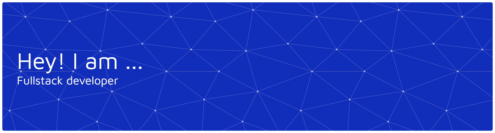

  

 <h1>Olá, sou Gregório Lotz 👋</h1>

💻 Cursando Ciência da Computação na UNIFIL Londrina 🎓

---

<h3 align="center">📊 GitHub Institucional — gregoriounifil</h3>

  

 

  
  

 

<h3 align="center">Languages and Tools:</h3>

  
  
  
  
  
  
  
  
  
  
  
  
  
  
  
  
  
  
  
  
  
  
  
  
  
  

---

### 🌐 Me encontre em:

